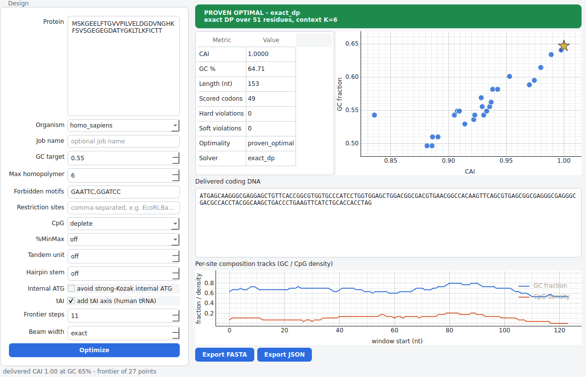

# BT4 — honest protein → mRNA back-translation

[](https://github.com/masonberger4/BT4/actions/workflows/ci.yml)
[](./LICENSE)
[](https://www.python.org/)

**BT4 turns a protein into an optimized coding DNA / mRNA sequence** for a target
organism (default *Homo sapiens*) — choosing synonymous codons to maximize codon
adaptation while honoring hard biological constraints, and it is **honest** about
exactly how optimal the answer is and how it was produced.

It treats codon optimization as what it really is — *constrained combinatorial
optimization over a codon trellis*, solved **exactly** — not greedy per-codon
substitution. Every result recomputes its own metrics from the delivered DNA,
carries a machine-readable **optimality certificate**, and ships a content-hashed
**provenance manifest** so it is reproducible from its stamp.



*BT4 Studio: paste a protein, set your constraints, and get an exactly-optimized
coding sequence with an honest optimality badge and a CAI/GC trade-off frontier.*

---

## What it does today

- **Exact codon-trellis DP** over the *true* per-constraint context — no silent
  window cap, no greedy shortcut — with an explicit `beam` speed knob.
- **A real optimality certificate** on every result: `proven_optimal` when the
  full state space was explored, or honestly `beam_truncated` when you traded it
  for speed. BT4 never claims optimality it didn't earn.
- **Objectives:** CAI, **tAI** (real human tRNA copy numbers via the dos Reis
  wobble model), GC-target proximity, a 5′ translation ramp, CpG deplete/elevate,
  and a **%MinMax** codon-commonness term — returned as a **multi-objective Pareto
  frontier** (a simplex sweep over every active axis, not just CAI/GC), never a
  single magic-weighted number. (A codon-pair-bias term is implemented for the
  trellis but not yet exposed as a config knob.)
- **Global GC budget, two honest backends:** an OR-Tools **CP-SAT** backend for
  the pure-additive case (proven-optimal), and a **Lagrangian relaxation** that
  dualizes the budget into the exact DP so — unlike CP-SAT — it keeps local
  constraints and pairwise terms honored, with a gap-bounded certificate.
- **Hard constraints:** maximum homopolymer run, **max GC-run** (the "max GC
  length"), a whole-sequence **max repeat length** (direct/inverted/palindromic
  repeats anywhere, reverse-complement aware — enforced by refinement and reported
  honestly, since it is genuinely non-local), forbidden motifs with named
  **forbidden-sequence presets** (poly-A signal, TATA box, telomere repeat, …),
  **tandem & inverted-repeat** (hairpin) bans, an **internal strong-Kozak ATG**
  guard, and a **restriction-enzyme catalog** (IUPAC-aware, auto reverse-complement).
- **Multiple organisms:** human, *E. coli*, and *S. cerevisiae* codon tables out
  of the box, plus real **tAI** tables for human, mouse, and yeast (GtRNAdb tRNA
  counts); `bt4 build-table` builds an authentic codon table from your own CDS FASTA.
- **Benchmarked against real tools:** `scripts/compare_tools.py` places BT4 next
  to GeneOptimizer / IDT / Twist / GenScript on a cited, CC BY 4.0 panel — every
  metric recomputed from the sequence, and BT4 never claimed "better", just placed.
  `scripts/compare_reproducibility.py` adds a run-to-run **variability** view over
  three proteins × three *anonymized* algorithms × ten repeat runs (kept honestly
  separate from the named-tool board), with deterministic BT4 as a zero-spread
  reference.
- **Honest metrics:** every reported number (CAI, GC, violations) is recomputed
  from the delivered sequence, never trusted from the solver.
- **Reproducible provenance:** a content-hashed manifest (codon-table SHA-256 +
  config + seed + version) — a swapped table produces a different stamp.
- **Three ways to use it:** the **BT4 Studio** desktop app, a `bt4` **CLI**, and a
  stable **Python API** (`bt4.api`). FASTA / JSON export everywhere.
- **100% local and offline.** Nothing leaves your machine.
- **Optional Rust accelerator** (PyO3) for the hot-loop primitives, with an
  identical pure-Python fallback so nothing is required to run.

- **Optional 5′-folding refinement (`--refine`):** a simulated-annealing pass
  (synonymous-only, never adds a hard violation, honest `heuristic` certificate)
  that opens up start-proximal mRNA structure via a `FoldingModel`. With
  **ViennaRNA** installed (`bt4[fold]`) this is real ΔG; otherwise it uses a
  clearly-labeled uncalibrated proxy and says so — BT4 never presents the
  baseline as calibrated thermodynamics.

> **Honest about scope.** BT4's design aims wider still — SpliceAI/Pangolin-class
> splice models and a learned expression head. Those are on the roadmap and **not
> shipped yet**; BT4 refuses to present an unbuilt or uncalibrated model as if it
> were real. See [`CLAUDE.md`](./CLAUDE.md) §9 for the full plan.

---

## Download and run it locally

BT4 is a local desktop app — nothing is hosted, nothing phones home.

### Option A — install with `pipx` (recommended)

Get an isolated install and both the app and the CLI on your `PATH`:

```bash
pipx install "bt4[app] @ git+https://github.com/masonberger4/BT4"
bt4-studio        # launch the desktop app
bt4 --help        # or use the command line
```

### Option B — packaged app from a release

Tagged releases publish a standalone **BT4 Studio** bundle (macOS / Windows /
Linux) plus the Python wheel + sdist on the
[Releases page](https://github.com/masonberger4/BT4/releases). Download the
bundle for your OS, unzip, and run — no Python required.

### Option C — from source

```bash
git clone https://github.com/masonberger4/BT4
cd BT4
pip install -e '.[app]'
bt4-studio                 # or:  python -m bt4.app
```

---

## Use it

### Desktop app

`bt4-studio` (or `python -m bt4.app`): paste a protein, pick the organism, set a
GC target / max-homopolymer / max GC length / max repeat length / forbidden
motifs (and tick any forbidden-sequence presets), and click **Optimize**. **Hover
any control for a tooltip explaining what it does.** You get the optimality badge,
a recomputed-metrics table, the interactive CAI/GC frontier (the delivered point
starred), the coding sequence, and one-click FASTA/JSON export. The optimization
runs on a background thread, so the window never blocks.

### Command line

```bash
bt4 optimize MAALKHETQW --max-homopolymer 5 --enzyme EcoRI    # summary
bt4 optimize MAALKHETQW --max-gc-run 5 --max-repeat-length 10 # GC-run + repeat caps
bt4 optimize MAALKHETQW --forbid-preset poly_a_signal         # ban a preset's motifs
bt4 optimize MAALKHETQW --fasta                               # FASTA to stdout
bt4 optimize MAALKHETQW --json                                # JSON + manifest
bt4 validate ATGGCC...TAA --max-homopolymer 6                 # audit a sequence
bt4 tracks ATGGCC...TAA --nt-window 50                        # per-site GC/CpG/%MinMax tracks
bt4 organisms   # codon tables    bt4 enzymes   # enzymes    bt4 presets   # forbidden presets
bt4 build-table my_cds.fasta --organism my_species --out .    # table from real CDS
```

An optional headless HTTP API is available too (`pip install -e '.[service]'`,
then `uvicorn bt4.service.api:app`) exposing `/optimize`, `/frontier`,
`/validate`, `/organisms`, and `/health`.

### Python API

```python
from bt4 import api

result = api.optimize("MAALKHETQW", api.OptimizeConfig(max_homopolymer=5))
print(result.dna, result.certificate.status.value)   # ...TAA  proven_optimal
print(result.audit["cai"], result.metrics.gc)        # recomputed from the DNA

frontier = api.frontier("MAALKHETQW", steps=11)       # CAI vs GC Pareto frontier
report = api.validate(result.dna, api.OptimizeConfig(max_homopolymer=5))
```

---

## How it works (60 seconds)

The core is a **codon trellis**: one layer per residue, each holding that amino
acid's synonymous codons. A dynamic program walks the trellis, carrying exactly
the sequence context each constraint declares it needs, and finds the assignment
that maximizes the (weighted) additive objective while every hard constraint's
`ok_suffix` veto holds. Because the state carries the *true* per-constraint
context, the result is **exactly optimal** for that objective — and the certificate
says so. Sweeping the objective weights over the unit simplex — CAI vs GC, and
any ramp/CpG/%MinMax axes you activate — traces the **Pareto frontier**; the
delivered point is the trade-off you chose.

The whole system is a **strict, acyclic layering** (`domain` → pure layers →
`pipeline` → `api` → `cli`/`app`/`service`) enforced in CI by import-linter, and
a set of **honesty invariants** (round-trip, reported == computed,
`ok_suffix ⇔ validate`, `delta == score`, certificate honesty, determinism) that
are **property-tested**, not just documented. The full design rationale lives in
[`CLAUDE.md`](./CLAUDE.md).

---

## Develop

```bash
pip install -e '.[dev]'   # or '.[dev,app]' to include the desktop app

ruff check src tests      # lint
mypy                      # strict type-check
lint-imports              # enforce the layering contract
pytest                    # property + integration + determinism tests
```

Optional Rust accelerator (a pure-Python fallback is used when it isn't built):

```bash
pip install maturin
maturin develop -m rust/bt4_core/Cargo.toml   # builds the `bt4_native` extension
```

New to the codebase? Read [`CLAUDE.md`](./CLAUDE.md) first (the design
constitution), then [`CONTRIBUTING.md`](./CONTRIBUTING.md). Adding a constraint or
objective is a new file plus its honesty property test — never an engine edit.

## Roadmap

Phases 0–1 are done and Phase 2 is largely complete: the multi-objective
frontier, the desktop app, **tAI** (real GtRNAdb tRNA data), 5′-ramp / CpG /
%MinMax objectives, tandem & inverted-repeat and internal-ATG constraints, a
cited tool benchmark, and two GC-budget backends — OR-Tools CP-SAT and an honest
**exact budget DP** (which, unlike CP-SAT, keeps local constraints and pairwise
terms under the budget) — have landed. A codon-pair-bias term (`CpbTerm`) is
implemented for the trellis but not yet wired to a config knob. The validated
splice / folding / expression models are next (the `FoldingModel` and
`SplicePredictor` contracts and honest baselines are already in place). See
[`CLAUDE.md`](./CLAUDE.md) §9.

## Contributing

Contributions are welcome — see [`CONTRIBUTING.md`](./CONTRIBUTING.md) and the
[`Code of Conduct`](./CODE_OF_CONDUCT.md). Please keep the layering contract and
the honesty invariants intact (CI enforces both).

## License

[MIT](./LICENSE).
